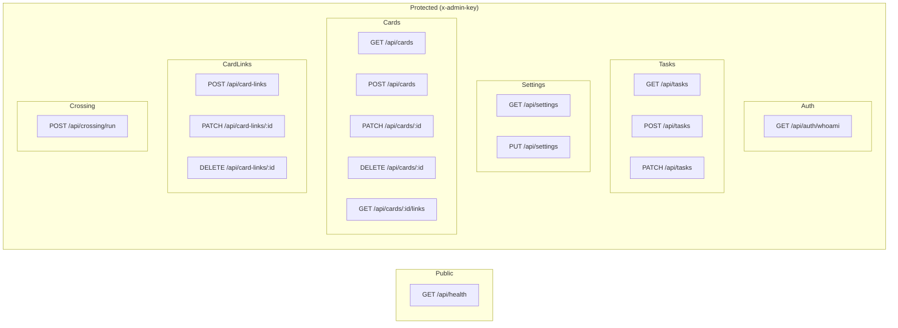
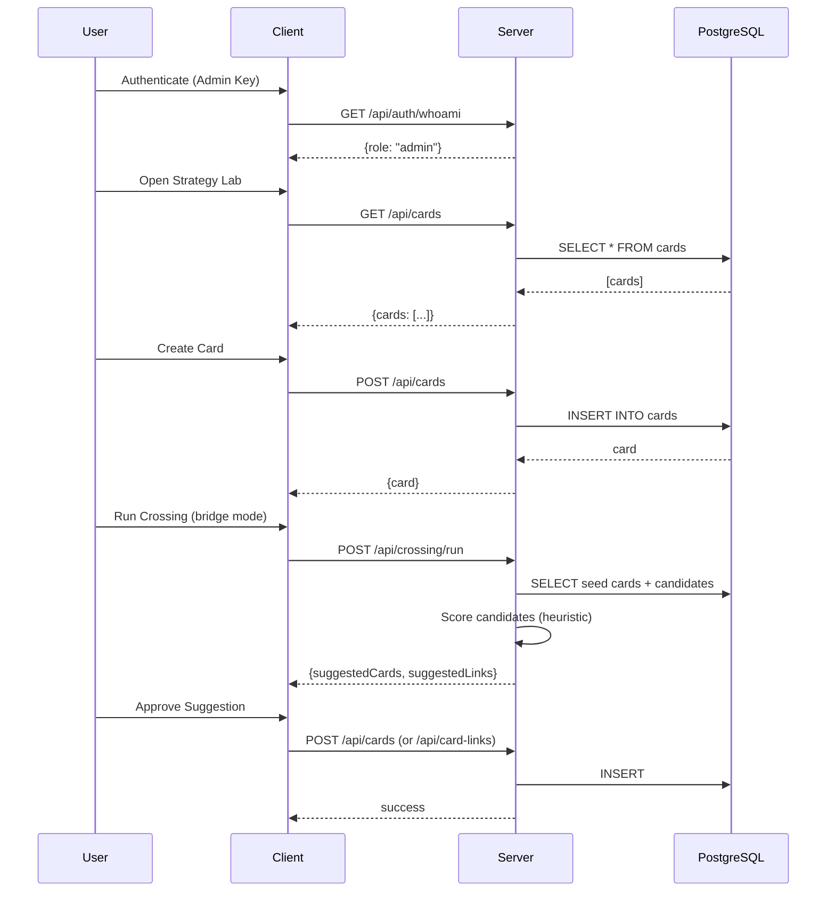

# Big Bro – Aktueller Projekt-Fortschritt (Stand: Januar 2026)

---

## Überblick

**Big-Bro** ist ein Railway-ready Monolith mit **Node.js/Express Backend** und **React/TypeScript Frontend** für Task- und Settings-Management sowie strategische Ideenverwaltung.

### Projektziel
Ein umfassendes System zur:
- **Task-Verwaltung** (Kanban-Stil: todo → doing → done)
- **Strategischen Ideenentwicklung** via "Strategy Lab" (v0.2)
- **Card-basiertem Wissensmanagement** mit Verlinkungen und Heuristiken
- **Zukünftig**: AI-Integration (Crossing Heuristic), Templates, erweiterte Auth

### Kern-Features (geplant)
| Feature | Status |
|---------|--------|
| Task Management | ✅ Fertig |
| Settings Store | ✅ Fertig |
| Strategy Lab (Cards) | ✅ Fertig (MVP) |
| Crossing Heuristic | ✅ Fertig (deterministic, no AI) |
| Auth System | ✅ Fertig (Admin-Key-basiert) |
| PostgreSQL Integration | ✅ Fertig |
| Templates | ❌ Noch nicht implementiert |
| Multi-User Support | ❌ Noch nicht implementiert |

---

## Implementierte Features

### ✅ Vollständig implementiert

| Feature | Beschreibung | Version |
|---------|--------------|---------|
| **Health Monitoring** | Öffentlicher `/api/health` Endpoint mit DB-Status | v0.1+ |
| **Task Management** | CRUD für Tasks mit Status (todo/doing/done) | v0.1+ |
| **Settings Management** | Key-Value Store für App-Einstellungen | v0.1+ |
| **Admin Authentication** | x-admin-key Header-basierte Auth | v0.1+ |
| **PostgreSQL Integration** | Auto-Schema-Initialisierung, Railway-ready | v0.1+ |
| **Rate Limiting** | In-Memory (100 req/15min pro IP) | v0.1+ |
| **SPA Support** | Client-Side Routing mit Fallback | v0.1+ |
| **Strategy Lab Cards** | CRUD für Ideen-Cards mit Type/Status/Tags | v0.2 |
| **Card Links** | Beziehungen zwischen Cards (supports/contradicts/bridges/related) | v0.2 |
| **Crossing Heuristic** | Deterministische Vorschläge (bridge/critique/combine Mode) | v0.2 |
| **Railway Deployment** | Zero-Config Auto-Deploy | v0.1+ |

### 🔶 Teilweise implementiert

| Feature | Status | Details |
|---------|--------|---------|
| **Crossing Heuristic** | MVP | Deterministische Logik, kein AI – `card_runs` Tabelle vorbereitet |
| **Card Filtering** | Basic | Tag-Suche via LIKE (Substring-Match), kein Array-Support |

---

## Offene / In-Arbeit Features

### Priorisierte To-Dos

| Priorität | Feature | Beschreibung |
|-----------|---------|--------------|
| 🔴 **Hoch** | **AI-gestützte Crossing Heuristic** | Scoring/Matching Mechaniken für Strategy Lab |
| 🔴 **Hoch** | **Templates System** | Wiederverwendbare Card-Templates |
| 🟡 **Mittel** | **Multi-User Auth** | Benutzerkonten, Rollen, Berechtigungen |
| 🟡 **Mittel** | **Card Pagination** | Performance für große Card-Collections |
| 🟡 **Mittel** | **Tags als Array** | Migration von TEXT zu ARRAY für bessere Filterung |
| 🟢 **Niedrig** | **DB-Indexes** | Indexes auf `cards.status`, `cards.type` |
| 🟢 **Niedrig** | **Card Ownership** | Cards Benutzern zuordnen |
| 🟢 **Niedrig** | **Graph Visualization** | Visuelle Darstellung der Card-Links |

---

## Technische Architektur

### Stack

```
┌─────────────────────────────────────────────────────────────┐
│                        FRONTEND                              │
│  React 18 + TypeScript 5 + Vite 5                           │
│  - SPA mit Client-Side Routing                               │
│  - API Client (fetch-basiert)                                │
│  - CSS (kein Framework)                                      │
└─────────────────────────────────────────────────────────────┘
                              │
                              │ /api/* (Proxy in Dev)
                              ▼
┌─────────────────────────────────────────────────────────────┐
│                        BACKEND                               │
│  Node.js 18+ / Express 4.18                                 │
│  - CommonJS Modules                                          │
│  - Helmet (Security Headers)                                 │
│  - CORS                                                      │
│  - Rate Limiting (In-Memory)                                 │
└─────────────────────────────────────────────────────────────┘
                              │
                              │ pg (node-postgres)
                              ▼
┌─────────────────────────────────────────────────────────────┐
│                       DATABASE                               │
│  PostgreSQL (Railway Add-on oder lokal)                     │
│  - Idempotente Schema-Initialisierung                        │
│  - SSL für Remote-Verbindungen                               │
└─────────────────────────────────────────────────────────────┘
```

### Dependency Overview

**Server (`server/package.json`)**:
- `express` ^4.18.2 – Web Framework
- `pg` ^8.11.3 – PostgreSQL Client
- `dotenv` ^16.3.1 – Environment Variables
- `cors` ^2.8.5 – CORS Middleware
- `helmet` ^7.1.0 – Security Headers
- `nodemon` ^3.0.2 (dev) – Hot Reload

**Client (`client/package.json`)**:
- `react` ^18.2.0 – UI Framework
- `react-dom` ^18.2.0 – React DOM
- `vite` ^5.0.8 – Build Tool
- `typescript` ^5.3.3 – TypeScript

### DB-Schema-Highlights

```sql
-- Core Tables (v0.1)
┌────────────────────────────────────────────┐
│ settings                                    │
├────────────────────────────────────────────┤
│ key TEXT PRIMARY KEY                        │
│ value JSONB NOT NULL                        │
│ updated_at TIMESTAMPTZ                      │
└────────────────────────────────────────────┘

┌────────────────────────────────────────────┐
│ tasks                                       │
├────────────────────────────────────────────┤
│ id UUID PRIMARY KEY                         │
│ title TEXT NOT NULL                         │
│ status TEXT (todo/doing/done)               │
│ created_at, updated_at TIMESTAMPTZ          │
└────────────────────────────────────────────┘

-- Strategy Lab Tables (v0.2)
┌────────────────────────────────────────────┐
│ cards                                       │
├────────────────────────────────────────────┤
│ id UUID PRIMARY KEY                         │
│ title TEXT NOT NULL                         │
│ type TEXT (idea/strategy/bridge/critique)   │
│ content TEXT                                │
│ tags TEXT (comma-separated)                 │
│ status TEXT (draft/active/archived)         │
│ created_at, updated_at TIMESTAMPTZ          │
└────────────────────────────────────────────┘

┌────────────────────────────────────────────┐
│ card_links                                  │
├────────────────────────────────────────────┤
│ id UUID PRIMARY KEY                         │
│ from_card_id UUID FK → cards(id) CASCADE    │
│ to_card_id UUID FK → cards(id) CASCADE      │
│ link_type TEXT (supports/contradicts/...)   │
│ strength INT (1-5)                          │
│ note TEXT                                   │
│ created_at, updated_at TIMESTAMPTZ          │
└────────────────────────────────────────────┘

┌────────────────────────────────────────────┐
│ card_runs (AI Placeholder)                  │
├────────────────────────────────────────────┤
│ id UUID PRIMARY KEY                         │
│ input JSONB                                 │
│ output JSONB                                │
│ created_at TIMESTAMPTZ                      │
└────────────────────────────────────────────┘
```

### Deployment-Status

| Aspekt | Status | Details |
|--------|--------|---------|
| **Railway Ready** | ✅ | Auto-Detect via package.json |
| **Docker** | ❌ | Kein Dockerfile vorhanden |
| **CI/CD** | ❌ | Keine GitHub Actions |
| **Build** | ✅ | `npm run build` (Vite) |
| **Start** | ✅ | `npm start` (Node.js) |
| **SSL** | ✅ | Auto via Railway |
| **ENV Vars** | ✅ | ADMIN_KEY, DATABASE_URL, PORT, CORS_ORIGIN |

---

## Gesamt-Blueprint

> **Hinweis**: Kein separates Blueprint-Dokument (`blueprint.md`, `architecture.md`) im Repository gefunden. Nachfolgend ein vorgeschlagener System-Blueprint basierend auf der Codebase-Analyse.

### System Architecture (Mermaid)

```mermaid
flowchart TB
    subgraph Client["Frontend (React/Vite)"]
        UI[App.tsx]
        API_CLIENT[api.ts Client]
    end
    
    subgraph Server["Backend (Express)"]
        MW_HELMET[Helmet]
        MW_CORS[CORS]
        MW_RATE[Rate Limit]
        MW_AUTH[requireAuth]
        MW_DB[requireDb]
        
        subgraph Routes
            R_HEALTH[/api/health]
            R_AUTH[/api/auth/*]
            R_TASKS[/api/tasks]
            R_SETTINGS[/api/settings]
            R_CARDS[/api/cards/*]
            R_LINKS[/api/card-links/*]
            R_CROSSING[/api/crossing/*]
        end
    end
    
    subgraph Database["PostgreSQL"]
        T_SETTINGS[(settings)]
        T_TASKS[(tasks)]
        T_CARDS[(cards)]
        T_LINKS[(card_links)]
        T_RUNS[(card_runs)]
    end
    
    UI --> API_CLIENT
    API_CLIENT -->|x-admin-key| MW_HELMET
    MW_HELMET --> MW_CORS
    MW_CORS --> MW_RATE
    MW_RATE --> Routes
    
    R_HEALTH --> Database
    R_AUTH --> MW_AUTH
    R_TASKS --> MW_AUTH --> MW_DB --> T_TASKS
    R_SETTINGS --> MW_AUTH --> MW_DB --> T_SETTINGS
    R_CARDS --> MW_AUTH --> MW_DB --> T_CARDS
    R_LINKS --> MW_AUTH --> MW_DB --> T_LINKS
    R_CROSSING --> MW_AUTH --> MW_DB --> T_CARDS
    
    T_LINKS -.->|FK| T_CARDS
```

### API Endpoint Map



### Data Flow (Strategy Lab)



---

## Risiken / Verbesserungsvorschläge

### 🔴 Sicherheit

| Risiko | Schwere | Empfehlung |
|--------|---------|------------|
| **Single Admin Key** | Mittel | Multi-User Auth mit JWT/Sessions implementieren |
| **Rate Limiting In-Memory** | Mittel | Redis-basiertes Rate Limiting für Skalierung |
| **Keine Input-Validierung** | Niedrig | Schema-Validierung (Joi/Zod) für Requests hinzufügen |
| **CSP deaktiviert** | Niedrig | Content Security Policy konfigurieren |

### 🟡 Performance

| Risiko | Schwere | Empfehlung |
|--------|---------|------------|
| **Fehlende DB-Indexes** | Mittel | Indexes auf `cards.status`, `cards.type`, `cards.tags` |
| **Keine Pagination** | Mittel | Limit/Offset für `/api/cards` und `/api/tasks` |
| **Tags als TEXT** | Niedrig | Migration zu `TEXT[]` für GIN-Index |
| **N+1 Queries** | Niedrig | Card Links in Bulk laden |

### 🟢 Code-Qualität

| Aspekt | Status | Empfehlung |
|--------|--------|------------|
| **Tests** | ❌ Fehlen | Unit + Integration Tests (Jest/Vitest) |
| **TypeScript Backend** | ❌ CommonJS | Migration zu TypeScript |
| **Linting** | ❌ Fehlt | ESLint + Prettier konfigurieren |
| **Error Boundaries** | ❌ Fehlen | React Error Boundaries hinzufügen |
| **API Docs** | ❌ Fehlen | OpenAPI/Swagger Dokumentation |

---

## Nächste Schritte

### Empfohlene Prioritäten

```
┌─────────────────────────────────────────────────────────────┐
│ PHASE 1: Stabilisierung (1-2 Wochen)                        │
├─────────────────────────────────────────────────────────────┤
│ □ Unit Tests für Backend-Routes hinzufügen                   │
│ □ Integration Tests für API-Endpoints                        │
│ □ ESLint/Prettier konfigurieren                              │
│ □ DB-Indexes hinzufügen                                      │
│ □ Pagination für Cards/Tasks                                 │
└─────────────────────────────────────────────────────────────┘
                              │
                              ▼
┌─────────────────────────────────────────────────────────────┐
│ PHASE 2: AI-Integration (2-4 Wochen)                         │
├─────────────────────────────────────────────────────────────┤
│ □ Scoring/Matching Mechaniken für Strategy Cards erweitern   │
│ □ AI-Adapter-Interface (OpenAI/Anthropic)                    │
│ □ Crossing Heuristic mit AI erweitern                        │
│ □ card_runs Tabelle für AI-Logs nutzen                       │
│ □ Rate Limiting für AI-Calls                                 │
└─────────────────────────────────────────────────────────────┘
                              │
                              ▼
┌─────────────────────────────────────────────────────────────┐
│ PHASE 3: Multi-User & Templates (2-4 Wochen)                 │
├─────────────────────────────────────────────────────────────┤
│ □ User-Tabelle + Auth (JWT/Sessions)                         │
│ □ Card Ownership (user_id FK)                                │
│ □ Berechtigungssystem (Rollen)                               │
│ □ Template-System für Cards                                  │
│ □ Template-Sharing zwischen Users                            │
└─────────────────────────────────────────────────────────────┘
                              │
                              ▼
┌─────────────────────────────────────────────────────────────┐
│ PHASE 4: UX & Skalierung (fortlaufend)                       │
├─────────────────────────────────────────────────────────────┤
│ □ Graph-Visualisierung (D3.js/Cytoscape)                     │
│ □ UI-Framework (TailwindCSS/shadcn/ui)                       │
│ □ Redis für Sessions + Rate Limiting                         │
│ □ Docker/Kubernetes Support                                  │
│ □ CI/CD Pipeline (GitHub Actions)                            │
└─────────────────────────────────────────────────────────────┘
```

### Sofortige Quick Wins

1. **DB-Indexes** (5 Min):
   ```sql
   CREATE INDEX IF NOT EXISTS idx_cards_status ON cards(status);
   CREATE INDEX IF NOT EXISTS idx_cards_type ON cards(type);
   ```

2. **Pagination** (~30 Min): Query-Parameter `?limit=20&offset=0` für Cards

3. **Health Endpoint erweitern** (~15 Min): Uptime, Memory-Usage hinzufügen

---

## Dateistruktur (aktuell)

```
big-bro/
├── .env.example                 # ENV Template
├── .github/
│   ├── copilot-instructions.md  # AI Agent Rules
│   └── pull_request_template.md
├── client/                      # React Frontend
│   ├── src/
│   │   ├── App.tsx              # Haupt-UI (Tasks + Strategy Lab)
│   │   ├── App.css              # Styling
│   │   ├── services/api.ts      # API Client
│   │   └── main.tsx             # Entry Point
│   ├── vite.config.ts
│   └── package.json
├── server/                      # Express Backend
│   ├── src/
│   │   ├── server.js            # Server Entry
│   │   ├── config.js            # ENV Config
│   │   ├── db.js                # PostgreSQL Pool + Schema
│   │   ├── middleware/
│   │   │   ├── auth.js          # x-admin-key Auth
│   │   │   ├── error.js         # Error Handler
│   │   │   ├── rateLimit.js     # Rate Limiting
│   │   │   └── requireDb.js     # DB Required Guard
│   │   └── routes/
│   │       ├── auth.js          # /api/auth/*
│   │       ├── cards.js         # /api/cards/*
│   │       ├── card-links.js    # /api/card-links/*
│   │       ├── crossing.js      # /api/crossing/*
│   │       ├── health.js        # /api/health
│   │       ├── settings.js      # /api/settings
│   │       └── tasks.js         # /api/tasks
│   └── package.json
├── docs/
│   ├── AGENT_REPORTING.md       # AI Reporting Guidelines
│   └── agent-reports/           # PR Reports
├── package.json                 # Root Workspace
├── README.md
└── CONTRIBUTING.md
```

---

## Zusammenfassung

**Big-Bro v0.2** ist ein funktionierendes MVP mit:
- ✅ Task Management
- ✅ Strategy Lab (Cards + Links + Crossing Heuristic)
- ✅ Admin-Key-basierte Auth
- ✅ Railway-ready Deployment
- ✅ PostgreSQL mit idempotenter Schema-Init

**Hauptfokus für die nächsten Schritte**:
1. **Tests & Stabilität** – Unit/Integration Tests
2. **AI-Integration (Crossing Heuristic)** – Scoring/Matching Mechaniken erweitern
3. **Multi-User Support** – Skalierung für mehrere Benutzer

---

*Report generiert: Januar 2026*  
*Version: v0.2.0*  
*Analysiert von: Cascade AI*
